import { MuxPlayer } from '@mux/mux-player-astro';

This is my MSc(Eng) final project, where I designed and prototyped an inchworm robot to traverse fibre-optic cable ducts of 50mm diameter.
The robot is driven by a cylindrical cam and anisotropic friction, and the final prototype was able to travel 234mm/s, making it the fastest in the literature; see the video below!

<MuxPlayer
  playbackId="4pXHExFrmiXqNnC4VAuaNu0100PmWRhK5ei7TwLbbBI500"
  metadata={{ video_title: 'My Astro Video' }}
/>
_The inchworm robot travelling through a pipe in real time._

Below is a quick rundown of what the robot does, how it works, and how it performs.
For more thorough technical details (and maths), the thesis document itself can be found [here](../../../inchworm_robot/MSc_Thesis.pdf).

# What It Does
In telecommunications, a "draw rope" is a rope that is laid within a pipe or duct and used to install cables into the duct. By attaching a cable to one of the draw rope,
and pulling the other, a technician can easily install cables by pulling them into the duct. Herein lies the problem; it is very easy to accidentally pull the 
draw rope out of the duct, leaving the technician with no way of installing new cables!

The purpose of this robot is to re-lay the draw rope, allowing more cables to be installed. In particular, this project focused on a novel locomotion method for moving 
through the duct, and less on the rope-laying.

# How It Works
To move, an inchworm robot reaches forwards, grabs the wall, and pulls its body forwards, repeating this motion to slowly move along the duct.
This requires two mechanisms: one to allow the robot to reach and pull (extend/contract), and one to grip the walls.

This robot uses a cylindrical cam to implement the extension/contraction, and anisotropic friction for the wall gripping. What are these? Let's explain!

## Cylindrical Cam

A cylindrical cam turns the rotation of a cam *shaft* into linear motion (reciprocation) of a cam *follower* along the original axis of rotation.
The shaft and follower interface through a cam *path*, which is a groove carved into either the shaft or follower. The cam path defines the position of the cam follower at each
rotation angle of the cam shaft.

This sounds confusing; hopefully this diagram makes it make sense!

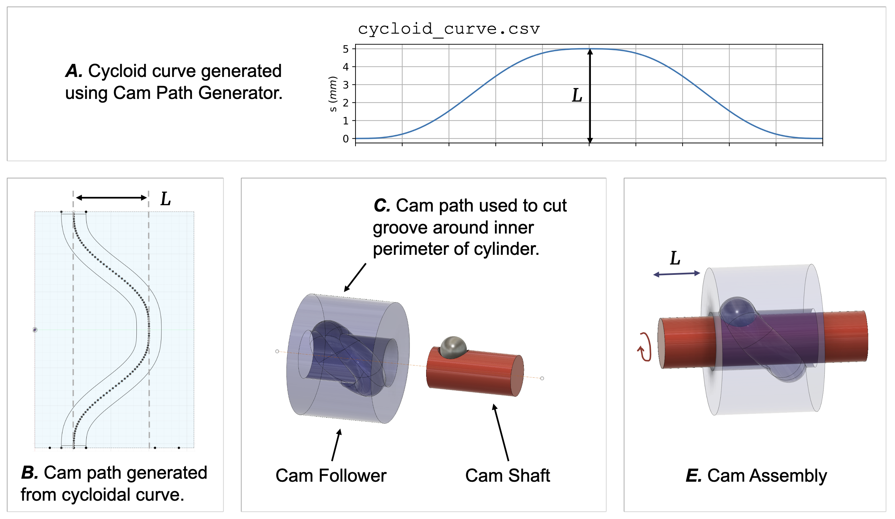
_Interfacing a cam shaft to a cam follower via a cam path._

The cam path controls the movement of the cam follower; it is possible to design a cam path that can stop the follower, slow it down, and speed it up, all within one rotation of
shaft.

To come up with a cam path that would work for inchworm motion, I wrote a python script to generate cycloidal, sinusoidial, and polynomial cam paths, and calculate the 
estimated affect of the cam path on the cam followers velocity, acceleration, and jerk (the derivative of acceleration).

The plots below show how important this is. When comparing cycloidal and sinusoidal cam paths, the cycloid introduces far more jerk in the follower motion, which will manifest as 
unwanted vibrations in the robot!

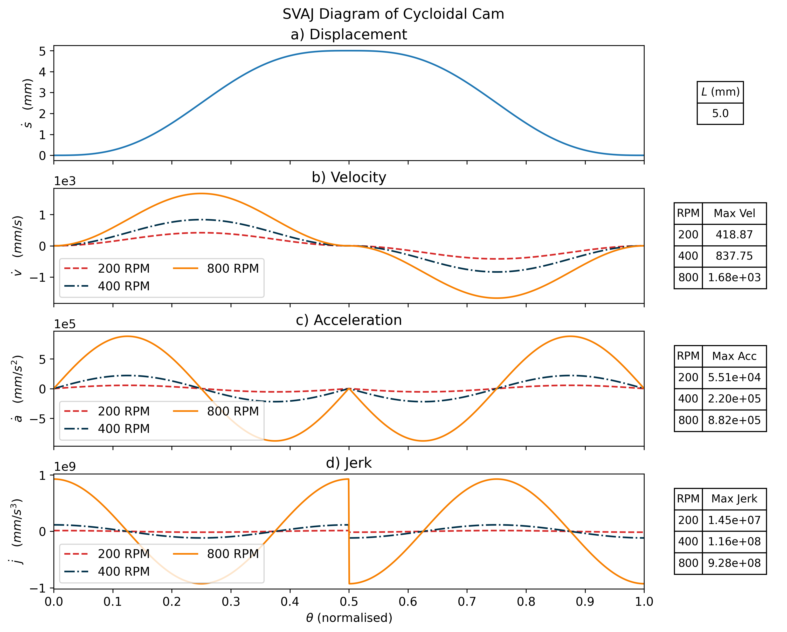
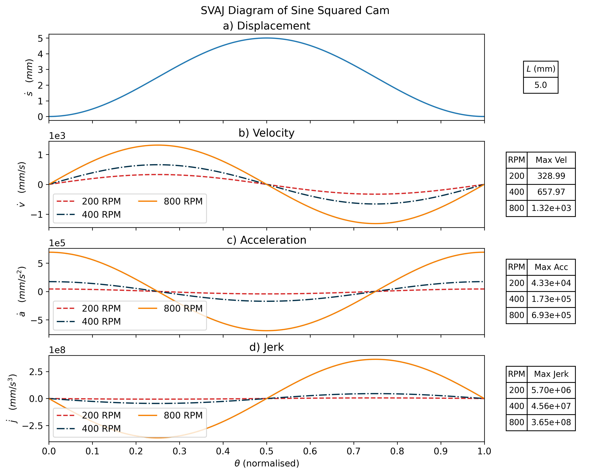
_Comparing two cam paths._

However, whilst the SVAJ plots make the cycloidal path look bad, it has a benefit; the follower is *stationary* twice per cam shaft rotation.
I liked the idea that the stationary pauses would allow time for a gripping mechanism to actuate, so I chose to go with the cycloidal cam path (for my sins).

I exported the cam path as a .csv and used it to model a cylindrical cam in Fusion360, which came out looking like this:
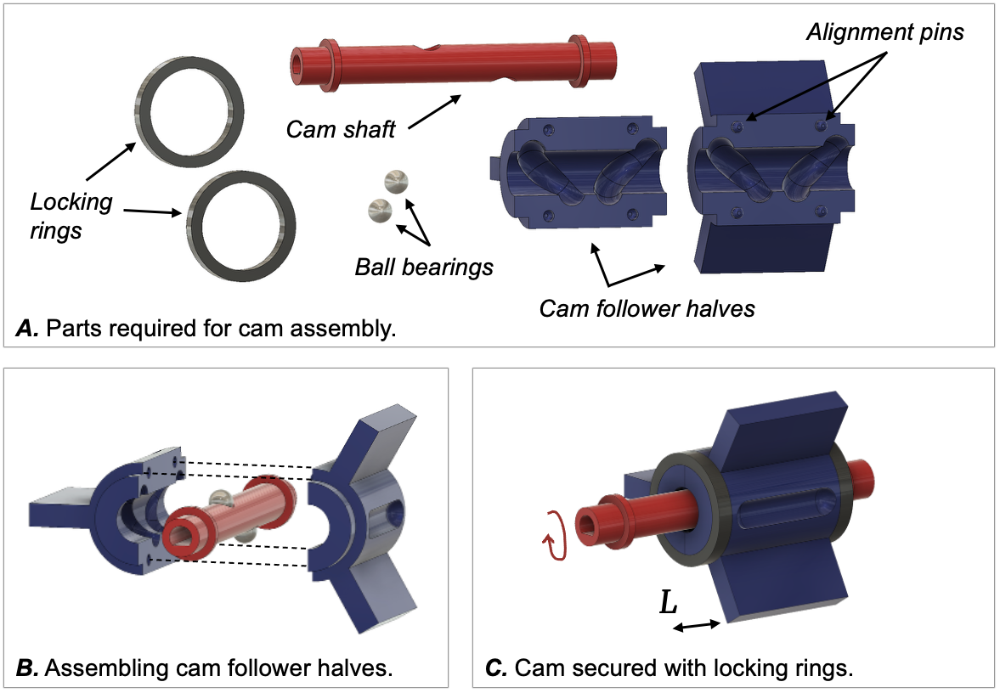
_The cylindrical cam CAD model (ignore the fins, this was V1!)_

I 3D printed the cam, inserted ball bearings, tested it, and it worked!
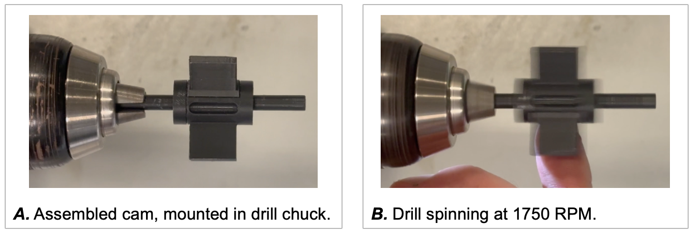
_Testing the cylindrical cam with a drill._

With the cylindrical cam built, I could move on the the second part - the grip/release mechanism, implemented using anisotropic friction.

## Anisotropic Friction (Bristles)

Essentially, anisotropic friction means a thing has more friction in one direction than another. In a pipe, where there are only two directions, this can be quite useful; 
we can freely slide forwards along the pipe, but not go backwards.

Anisotropic friction is implemented using radially distributed "bristles" around a core. The bristles are at an acute angle towards the core, which creates the anisotropic friction.
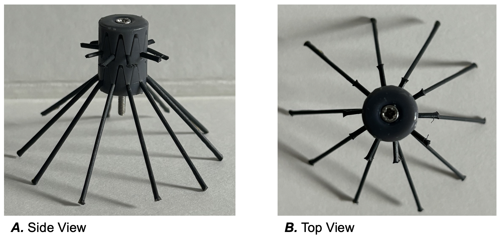
_An example bristle assembly._

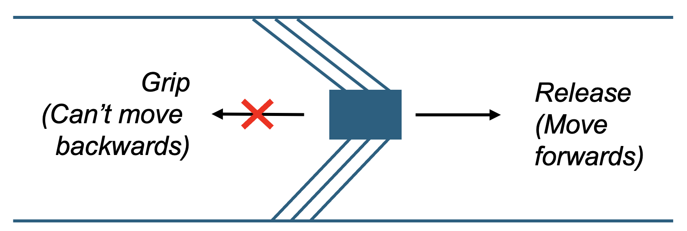
_Bristle assemblies implementing anisotropic friction._

An ideal bristle assembly has a low forwards force, and a high backwards force - it needs to be easy to push forwards, but hard to push back.
Different materials for the bristles were tested to establish the forces they required using a custom built rig and some force gauges.
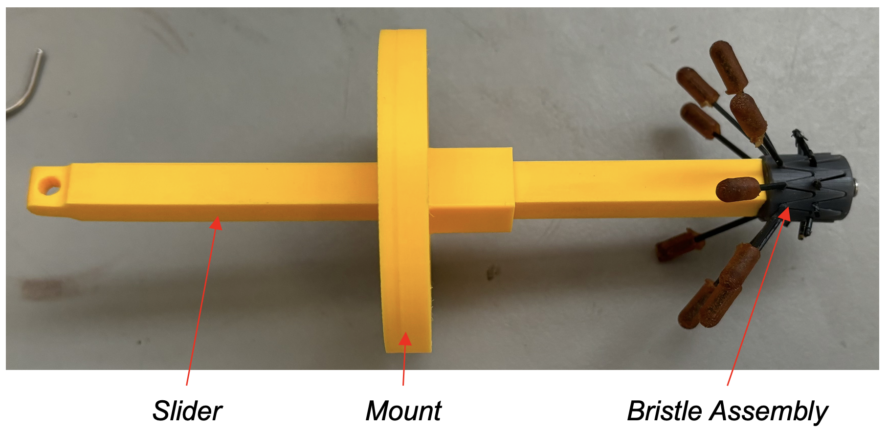
_Bristle Friction Testing Rig. By mounting the rig to a pipe, attaching a force gauge to the slider, and applying force, the forces required to move the bristle assembly backwards and forwards 
can be ascertained._

Then, the bristle assemblies were attached to a prototype version of the robot, whih was set off down a pipe. The average velocity of the robot was recorded each time, and the 
following plot was produced, highlighting that bristle assembly C produces the fastest robot.
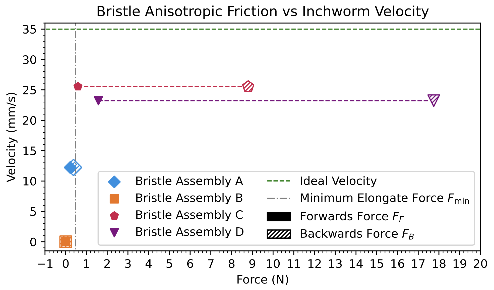
_Bristle friction vs velocity tests._

More academic analysis was done on these results, but it gets a bit boring, so see the thesis linked above for more details!

# Final Design
After many iterations, the final robot design looked like this:

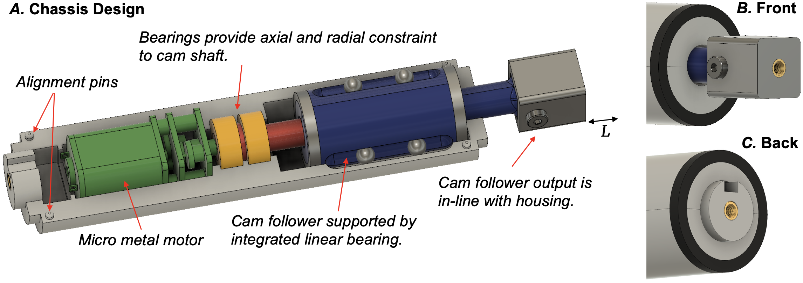
_Cross section of the robot in CAD, showing the inner workings and bristle mounts._

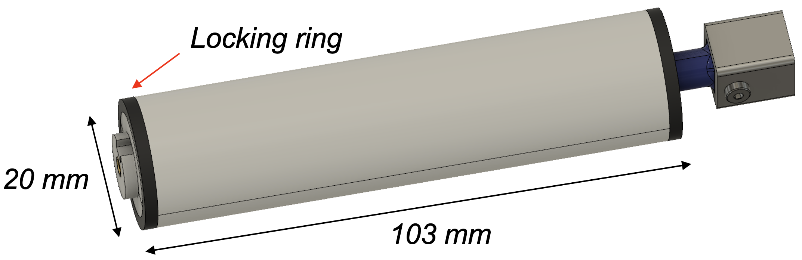
_Design of the assembled inchworm._

The cam is driven by a micrometal motor (as they're small and cheap) and powered externally. Two bearings constrain the cam shaft, and custom linear bearings are built into the chassis/housing to constrain the cam
follower. Two locking rings hold everything in place, as for some reason, I was hell-bent on avoiding screws!

# Final Assembly
Lo and behold, the final robot!

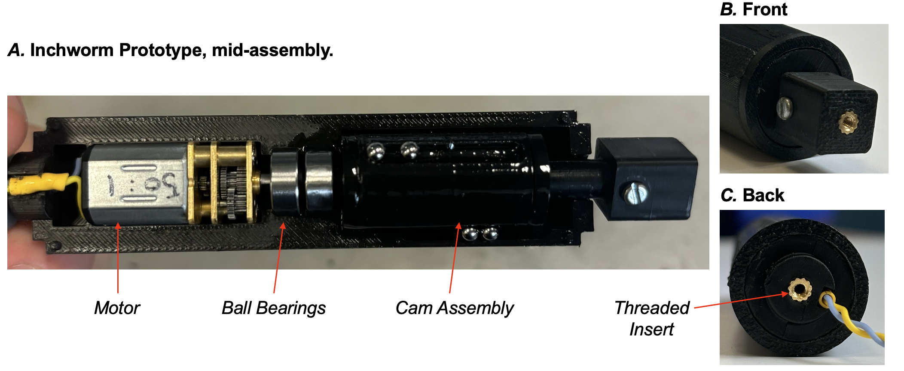
_The half-assembled inchworm robot._

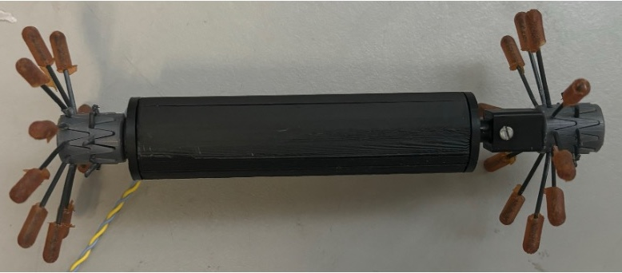

_The final robot._

<MuxPlayer
  playbackId="4pXHExFrmiXqNnC4VAuaNu0100PmWRhK5ei7TwLbbBI500"
  metadata={{ video_title: 'My Astro Video' }}
/>
_The inchworm robot travelling through a pipe in real time._

# Results
The project was awarded 86%, and I'm super proud of how it turned out!

If I ever get back into it, there's a few improvement to be made:
1. Improve the grip/release mechanism to allow for bidirectional movement.
2. Include a power tether, so that the range of the robot is not limited by the power tether range.
3. Use a bigger/faster motor, to make the robot even faster!